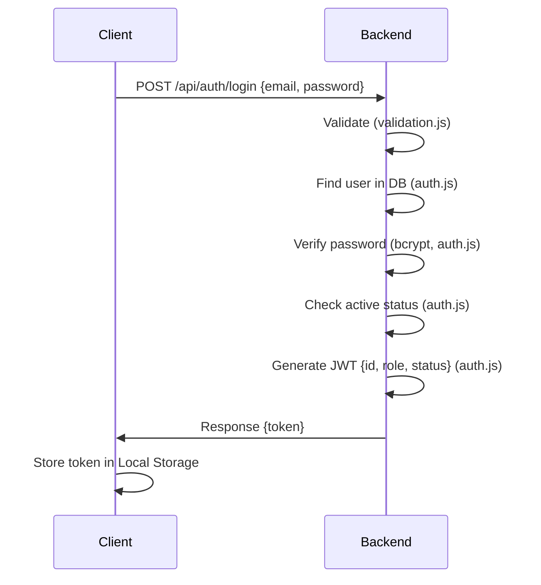
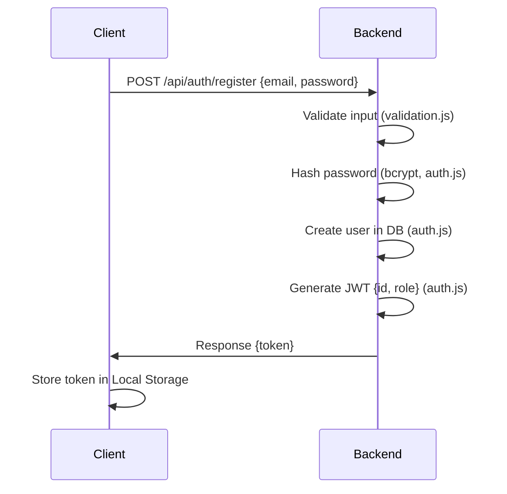
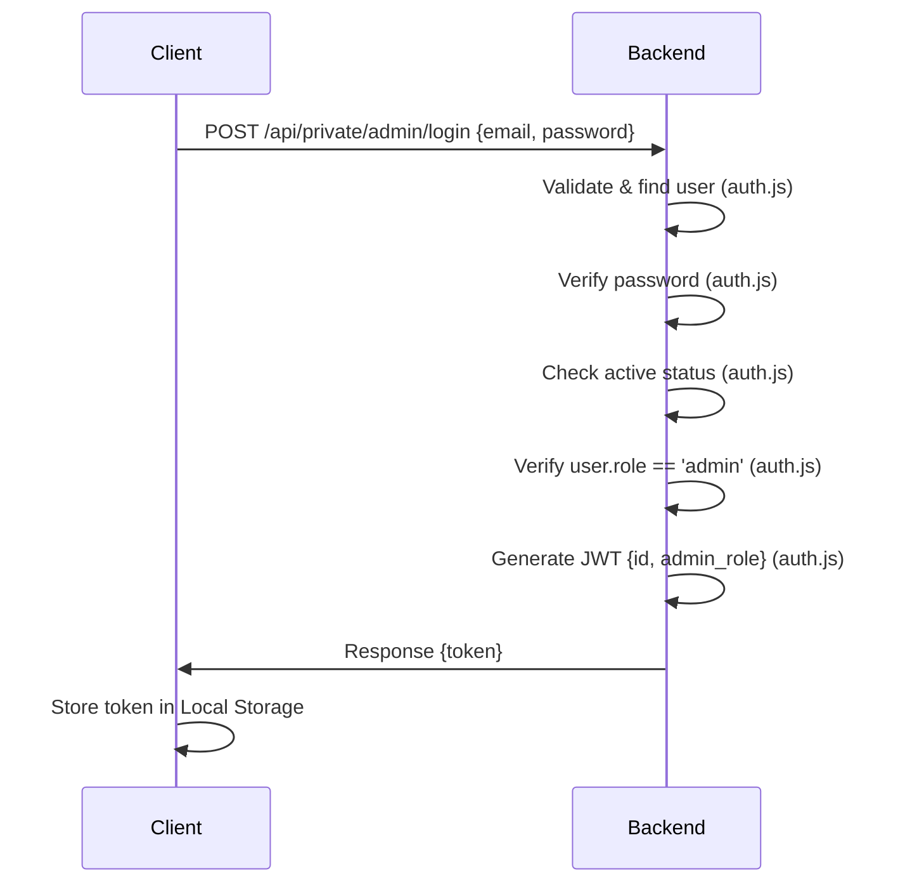
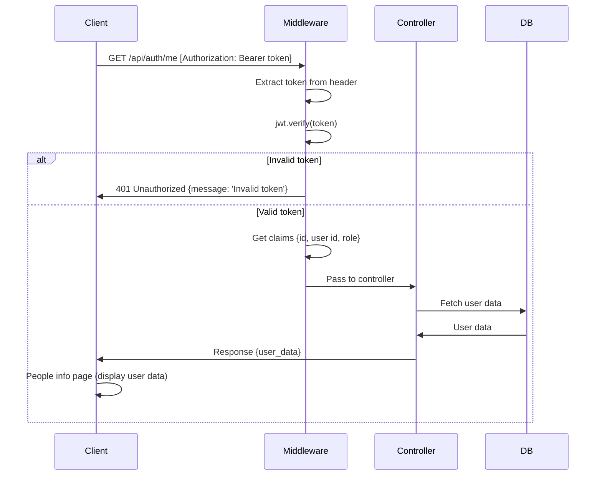
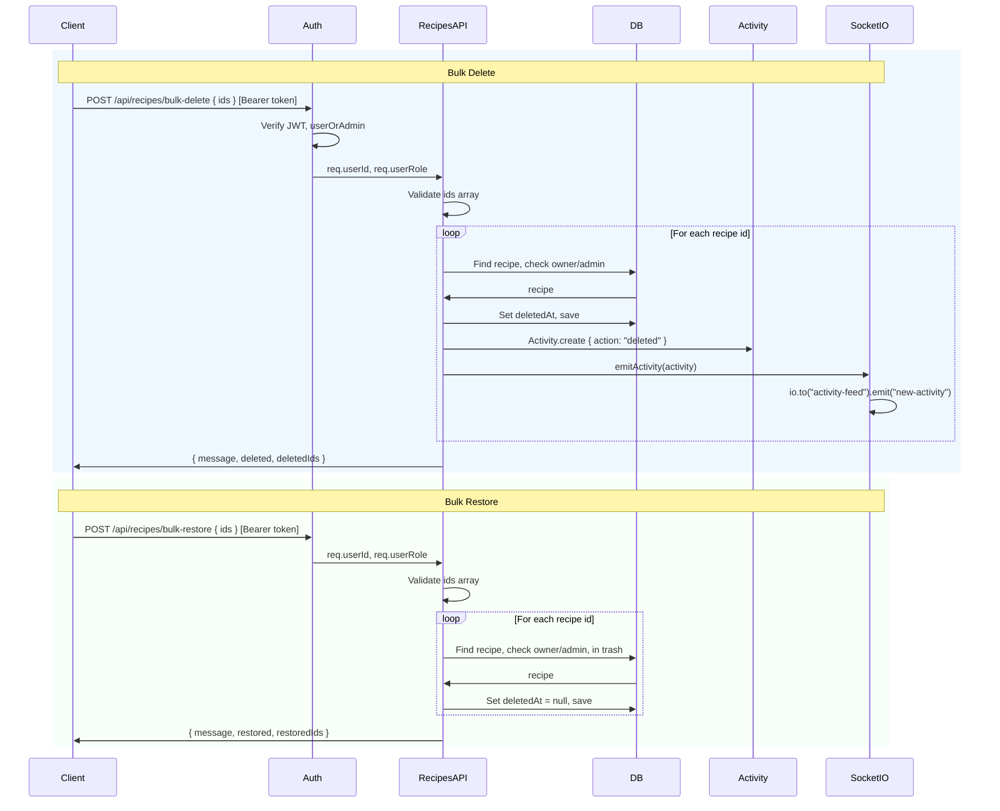
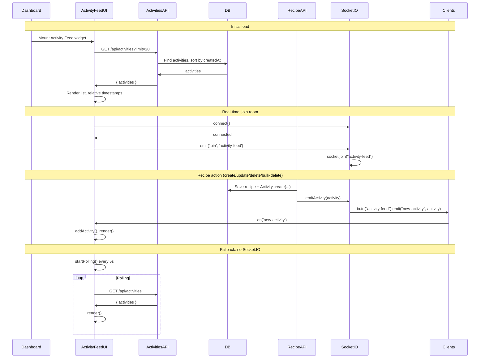

# Authentication & JWT Flow Diagrams

This document describes the four authentication and protected-route flows used in the Recipe Management System, plus **bulk operations** (bulk delete, bulk restore) and the **activity feed** (real-time and polling) flows.

---

## 1. Login Flow + JWT

Standard user login process.

| Step | Client (Browser) | Backend Server |
|------|------------------|----------------|
| 1 | **POST** `/api/auth/login` with `{email, password}` | |
| 2 | | **Validation** — Validate email/password via `validation.js` |
| 3 | | **Find user** in DB via `auth.js` |
| 4 | | **Verify password** via bcrypt + `auth.js` |
| 5 | | **Check Active status** via `auth.js` |
| 6 | | **Generate JWT** via `auth.js` (payload: `id`, `role`, `status`) |
| 7 | | **Response** → `{token}` |
| 8 | **Store token** in Local Storage (`login.html`) | |

---

## 2. Registration Flow + JWT

User registration process.

| Step | Client (Browser) | Backend Server |
|------|------------------|----------------|
| 1 | **POST** `/api/auth/register` with `{email, password}` | |
| 2 | | **Validate input** via `validation.js` |
| 3 | | **Hash password** via bcrypt + `auth.js` |
| 4 | | **Create user** in DB via `auth.js` |
| 5 | | **Generate JWT** via `auth.js` (payload: `id`, `role`) |
| 6 | | **Response** → `{token}` |
| 7 | **Store token** in Local Storage (`register.html`) | |

---

## 3. Admin Login Flow with JWT

Administrator login process.

| Step | Client (Browser) | Backend Server |
|------|------------------|----------------|
| 1 | **POST** `/api/private/admin/login` with `{email, password}` | |
| 2 | | **Validate & find user** via `auth.js` |
| 3 | | **Verify password** via `auth.js` |
| 4 | | **Check active status** via `auth.js` |
| 5 | | **Verify admin role** — `user.role == 'admin'` via `auth.js` |
| 6 | | **Generate JWT** (payload: `id`, `admin_role`) via `auth.js` |
| 7 | | **Response** → `{token}` |
| 8 | **Store token** in Local Storage (`admin_login.html`) | |

---

## 4. Protect Routes Access Flow

How protected routes are accessed using JWT.

| Step | Client (Browser) | Backend Server |
|------|------------------|----------------|
| 1 | **GET** `/api/auth/me` with header `Authorization: Bearer {token}` | |
| 2 | | **Auth middleware** — Extract token from header |
| 3 | | **Auth middleware** — Verify JWT via `jwt.verify()` |
| 4 | | **Valid?** |
| 4a | | **Invalid** → **401 Unauthorized** → `{message: 'Invalid token'}` |
| 4b | | **Valid** — Get claims `{id, user id, role}` |
| 5 | | Pass to controller |
| 6 | | Fetch **user data** from DB |
| 7 | | **Response** → `{user_data}` |
| 8 | **People info page** (display user data) | |

---

## 5. Bulk Operations Flow (Bulk Delete & Bulk Restore)

Bulk soft-delete and restore of multiple recipes. Owner can act on own recipes; admin can act on any.

### 5a. Bulk Delete

| Step | Client (Browser) | Backend Server |
|------|------------------|----------------|
| 1 | **POST** `/api/recipes/bulk-delete` with header `Authorization: Bearer {token}` and body `{ ids: [...] }` | |
| 2 | | **Auth middleware** — Verify JWT, attach `req.userId`, `req.userRole` |
| 3 | | **userOrAdmin** — Ensure user or admin |
| 4 | | **Validate** — Require `ids` array, non-empty |
| 5 | | **For each id**: Find recipe, check owner/admin, skip if already deleted |
| 6 | | Set `recipe.deletedAt = now`, save; create **Activity** (action: "deleted"); **emitActivity()** → Socket.IO |
| 7 | | **Response** → `{ message, deleted, deletedIds }` |
| 8 | **Update UI** (e.g. remove from list, show trash) | |

### 5b. Bulk Restore

| Step | Client (Browser) | Backend Server |
|------|------------------|----------------|
| 1 | **POST** `/api/recipes/bulk-restore` with header `Authorization: Bearer {token}` and body `{ ids: [...] }` | |
| 2 | | **Auth** + **userOrAdmin** (same as bulk-delete) |
| 3 | | **Validate** — Require `ids` array, non-empty |
| 4 | | **For each id**: Find recipe, check owner/admin, skip if not in trash |
| 5 | | Set `recipe.deletedAt = null`, save |
| 6 | | **Response** → `{ message, restored, restoredIds }` |
| 7 | **Update UI** (e.g. move from trash back to list) | |

---

## 6. Activity Feed Flow (Real-Time + Polling Fallback)

Dashboard widget that shows recent recipe create/update/delete activity. Uses Socket.IO for real-time updates with HTTP polling fallback.

| Step | Client (Browser) | Backend / Socket.IO |
|------|------------------|----------------------|
| 1 | **Dashboard loads** — Activity Feed widget mounts | |
| 2 | **GET** `/api/activities?limit=20` (initial load) | |
| 3 | | **Activities API** — Query Activity collection, sort by createdAt, return list |
| 4 | **Render list** — Relative timestamps (e.g. "2 minutes ago"), action icons | |
| 5 | **Socket.IO connect** — Connect to server, then **emit('join', 'activity-feed')** | |
| 6 | | **Server** — socket.join("activity-feed") |
| 7 | **On recipe create/update/delete (or bulk-delete)** | Backend calls **emitActivity({ userName, action, recipeTitle, createdAt })** |
| 8 | | **Socket.IO** — io.to("activity-feed").emit("new-activity", activity) |
| 9 | **Client** — Listens for **'new-activity'**, prepends to feed, re-renders | |
| 10 | **Fallback** — If Socket.IO fails or disconnects, **poll GET /api/activities** every 5s | |

---

## Summary

| Flow | Endpoint | Key Files |
|------|----------|-----------|
| Login | `POST /api/auth/login` | `validation.js`, `auth.js`, bcrypt |
| Register | `POST /api/auth/register` | `validation.js`, `auth.js`, bcrypt |
| Admin Login | `POST /api/private/admin/login` | `auth.js`, role check |
| Protected Routes | `GET /api/auth/me` | Auth middleware, `jwt.verify()` |
| Bulk Delete | `POST /api/recipes/bulk-delete` | `recipes.js`, auth, userOrAdmin, Activity, socket |
| Bulk Restore | `POST /api/recipes/bulk-restore` | `recipes.js`, auth, userOrAdmin |
| Activity Feed | `GET /api/activities`, Socket.IO `activity-feed` room | `activities.js`, `socket.js`, `activity-feed.js` |

All flows store the returned JWT in **Local Storage** on the client for subsequent authenticated requests.
