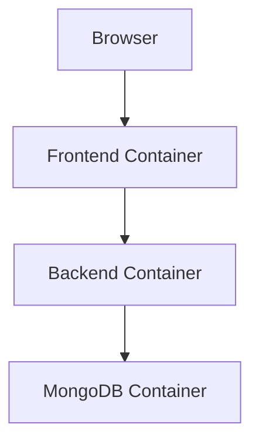

# Recipe Management System with Docker

## Overview
Fully Dockerized Recipe Management System with Node.js backend, MongoDB, and static HTML/CSS/JS frontend.  
**Features:** Backend, frontend, MongoDB in containers; `/api/student` endpoint for student info.

---

## Prerequisites
- **Docker Desktop** (or Docker Engine + Docker Compose)  
- Windows: enable **WSL2**  
- Verify:
```bash
docker --version
docker-compose --version
```

Setup

Clone repo:

git clone <repository-url>
cd 8.2HD

Run app:
```bash
docker-compose up --build       # first run
docker-compose up               # subsequent runs
docker-compose up -d            # background
```

Stop / clean:
```bash
docker-compose down             # stop
docker-compose down -v          # stop + volumes
docker-compose down --rmi all -v  # full cleanup
```
Access

Frontend: http://localhost:3000

Backend: http://localhost:5000

Student API: http://localhost:5000/api/student

```bash
{"name":"JANITHA JAYASANKA BOMIRIYA","studentId":"s224715468"}
```

MongoDB: mongodb://localhost:27017/recipe-management

onfiguration

All in docker-compose.yml:

PORT=5000

MONGO_URI=mongodb://mongodb:27017/recipe-management

JWT_SECRET=supersecretkey

NODE_ENV=production

Project Structure
8.2HD/
├── backend/      # Node.js app, APIs, Dockerfile
├── frontend/     # HTML/CSS/JS, Dockerfile, nginx.conf
├── docker-compose.yml
├── README.md
└── ...

Testing

```bash
docker ps                       # verify containers
curl http://localhost:5000/api/student
docker-compose logs frontend
docker-compose logs backend
docker-compose logs mongodb
```

Check frontend: http://localhost:3000

Check backend: http://localhost:5000

Docker Architecture

MongoDB Container → data in mongodb_data

Backend Container → Node.js app

Frontend Container → static frontend

Network → recipe-network



Volumes:

mongodb_data → MongoDB persistence

./backend/uploads → recipe images


---

